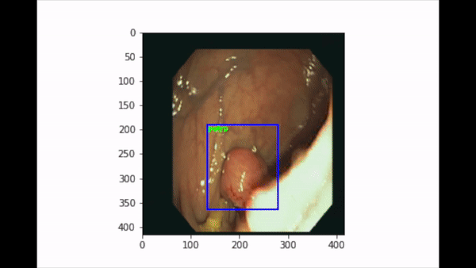

#  Polyp Vision

This is a project I worked on in the summer between my sophmore and junior year. It was a project that was dropped from a company I was interning at and I picked it up. The original idea was a tool for medical professionals performing colonoscopies that would localize and tag polyps in real time. This repo is just me experimenting with real time image processing and was my first real exprience with computer vision so its both poorly engineered and a bit simplistic. While not fully optimized or anything, I did manage to use some combonation of transfer learning, YOLOv3, and possibly some RCNN to build a system that worked, if very slowly. Below is a short gif of the system tagging polyps in single frames. I didn't have the processing power or expirience to build an actual live model that would work on videos. 

